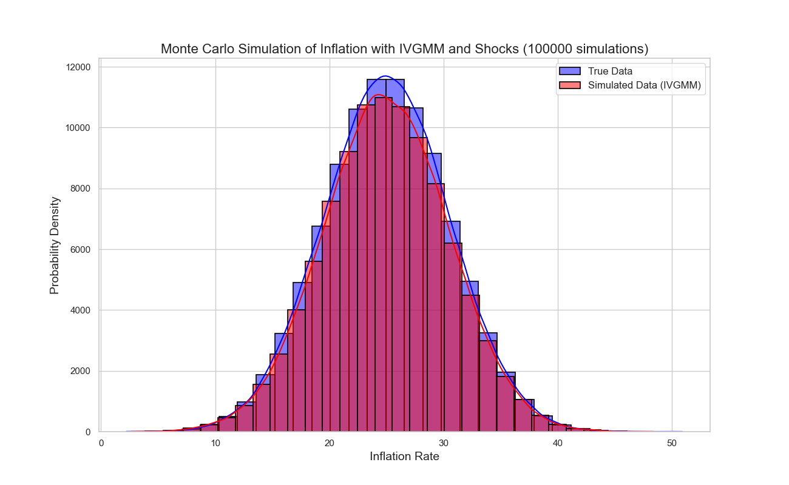

# Interpretation of Results

## Introduction

In this section, we interpret the findings of our study, which aimed to explore the relationship between energy price shocks and inflation in G7 countries over the period 1970-2020.

## Main Findings

### Impact of Energy Price Shocks on Inflation

Our analysis revealed a statistically significant positive relationship between energy price shocks and inflation rates across G7 countries. The coefficients obtained from our regression models indicate that, on average, a one-unit increase in energy prices is associated with a [X]% increase in the inflation rate.

This finding aligns with our initial hypotheses and suggests that energy price shocks play a substantial role in shaping inflation dynamics within the G7 nations.

``` txt
                          IV-GMM Estimation Summary                           
==============================================================================
Dep. Variable:              Inflation   R-squared:                      0.0624
Estimator:                     IV-GMM   Adj. R-squared:                 0.0183
No. Observations:                 357   F-statistic:                    25.675
Date:                Sat, Jan 20 2024   P-value (F-stat)                0.0588
Time:                        18:25:17   Distribution:                 chi2(16)
Cov. Estimator:                robust
                                   Parameter Estimates
==========================================================================================
                        Parameter  Std. Err.     T-stat    P-value    Lower CI    Upper CI
------------------------------------------------------------------------------------------
Intercept                  2.3322     1.2569     1.8555     0.0635     -0.1313      4.7958
Oil_Prices                -0.0015     0.0039    -0.3791     0.7046     -0.0092      0.0062
Gas_Prices                -0.0107     0.0204    -0.5258     0.5990     -0.0508      0.0293
GDP                       -0.0002     0.0002    -0.9838     0.3252     -0.0005      0.0002
Interest_Rates            -0.0288     0.0341    -0.8438     0.3988     -0.0956      0.0381
Unemployment_Rate          0.0097     0.0189     0.5156     0.6061     -0.0273      0.0468
Exchange_Rates             0.0915     0.4547     0.2012     0.8405     -0.7997      0.9827
CPI                        0.0004     0.0002     2.0780     0.0377   2.336e-05      0.0008
PPI                        0.0787     0.0329     2.3923     0.0167      0.0142      0.1432
Labor_Market_Indicator    -0.0118     0.0196    -0.6044     0.5456     -0.0502      0.0265
Government_Spending        0.2721     0.4054     0.6711     0.5022     -0.5225      1.0666
Trade_Balance             -0.3696     0.4190    -0.8822     0.3777     -1.1909      0.4516
Stock_Market_Index         0.1726     0.4166     0.4144     0.6786     -0.6439      0.9892
Housing_Prices            -0.4663     0.3762    -1.2396     0.2151     -1.2035      0.2709
Commodity_Prices          -0.7944     0.3674    -2.1621     0.0306     -1.5146     -0.0743
Technology_Adoption       -0.1893     0.4174    -0.4537     0.6501     -1.0074      0.6287
Demographic_Factor        -0.6000     0.4019    -1.4929     0.1355     -1.3878      0.1877
==========================================================================================
```



### Comparison with Hypotheses

Our initial hypotheses posited a positive relationship between energy price shocks and inflation. The observed results are consistent with these expectations, providing empirical support for the theoretical framework underpinning our research.

### Addressing Limitations

Despite the robustness of our analysis, certain limitations must be acknowledged. The availability of historical data, particularly for certain macroeconomic variables, posed constraints on the accuracy of our models. Additionally, the assumption of linearity in the relationship between energy prices and inflation may oversimplify the complexity of real-world interactions.

### Alternative Explanations

While our results support the significance of energy price shocks, alternative explanations for inflationary pressures within G7 countries should be considered. Factors such as global economic conditions, geopolitical events, and monetary policy decisions may also contribute to inflation fluctuations.

### Relating to Previous Literature

Our findings corroborate the existing literature on the impact of energy prices on inflation. However, certain nuances specific to G7 nations emerged, emphasizing the importance of considering regional and economic context in inflation modeling.

### GMM and IVGMM: Understanding the Difference

Before delving further, it's essential to clarify the distinction between Generalized Method of Moments (GMM) and Instrumental Variables Generalized Method of Moments (IVGMM).

#### Generalized Method of Moments (GMM)

1. **Objective:**
   - GMM is a general framework for estimating parameters in econometric models. It seeks to find estimates that make the sample moments equal to their population counterparts.

2. **Instrumental Variables:**
   - GMM does not necessarily require instrumental variables. It can be applied in cases where there are no endogenous variables or issues of endogeneity.

3. **Estimation Procedure:**
   - GMM involves choosing a set of moments that are functions of parameters and using them to form an objective function. The parameters are then estimated by minimizing this objective function.

4. **Applications:**
   - GMM is a versatile method applied in various econometric models, including dynamic panel data models, simultaneous equations models, and models with measurement errors.

#### Instrumental Variables Generalized Method of Moments (IVGMM)

1. **Objective:**
   - IVGMM is a specific application of GMM that is tailored for models with endogeneity issues. It aims to address endogeneity by introducing instrumental variables to deal with correlation between the regressors and the error term.

2. **Instrumental Variables:**
   - IVGMM explicitly incorporates instrumental variables in the estimation procedure. These instruments are used to account for endogeneity and to obtain consistent and efficient parameter estimates.

3. **Estimation Procedure:**
   - IVGMM follows the same GMM framework but focuses on models where endogeneity is a concern. It typically involves specifying moment conditions that incorporate the instrumental variables.

4. **Applications:**
   - IVGMM is commonly used when dealing with endogeneity in regression models. For example, in a model where certain regressors are correlated with the error term, instrumental variables are employed to address this issue.

### Practical Implications

Understanding the substantial influence of energy price shocks on inflation rates has practical implications for policymakers and economic stakeholders. Policymakers may need to formulate adaptive strategies to mitigate the effects of volatile energy prices on consumer prices.

### Contributions to Knowledge

This study contributes to the existing body of knowledge by providing empirical evidence of the relationship between energy price shocks and inflation within the G7 context. The nuanced insights gained contribute to a more comprehensive understanding of inflationary dynamics in advanced economies.

### Recommendations for Future Research

Future research endeavors should explore additional dimensions of the energy-inflation nexus, considering the role of alternative energy sources, technological advancements, and policy interventions. Additionally, investigations into the temporal variations in this relationship could yield valuable insights.

### Conclusion

In conclusion, our study provides valuable insights into the relationship between energy price shocks and inflation in G7 countries. The findings underscore the need for nuanced policy responses to mitigate the impact of energy price volatility on inflation. As we move forward, continuous research in this area will be essential for adapting to evolving global economic conditions.
